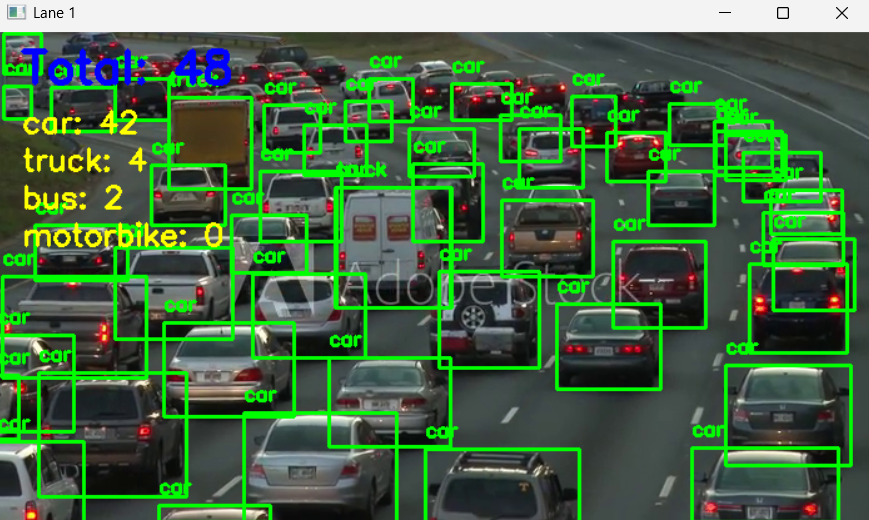

Traffic Optimizer 🚦

An AI-powered smart traffic management system that dynamically adjusts green signal timings based on real-time vehicle density. The project integrates YOLO for vehicle detection with a Spring Boot backend for traffic optimization, and a frontend simulator for visualization.

🚀 Features

Real-time Vehicle Detection using YOLO.

Dynamic Signal Timing is calculated by the Spring Boot backend.

Seamless Integration: YOLO sends results directly to the backend (Flask-free).

Frontend Simulation to visualize live traffic flow and optimized timings.

Postman API Collection for testing and simulation.

🏗️ Tech Stack

Computer Vision: YOLO (You Only Look Once) for vehicle detection.

Backend: Java Spring Boot.

Frontend: React / JavaScript (simulation UI).

Data Exchange: JSON over REST APIs.
## 📸 Screenshots  

### Dashboard  

### YOLO Vehicle Detection  

### Optimized Signal Timings  

### Traffic Flow Simulation  

